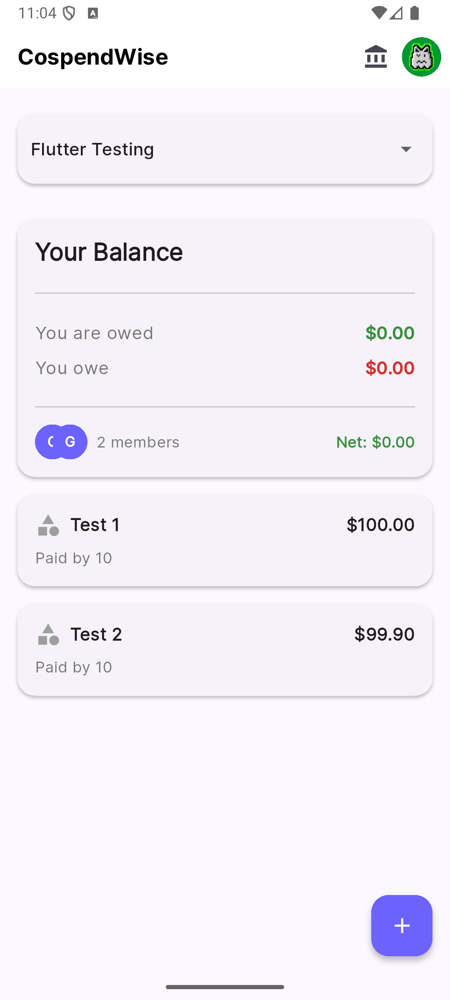
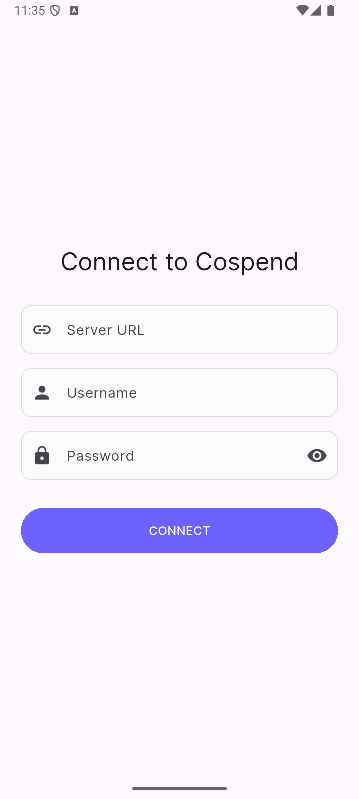
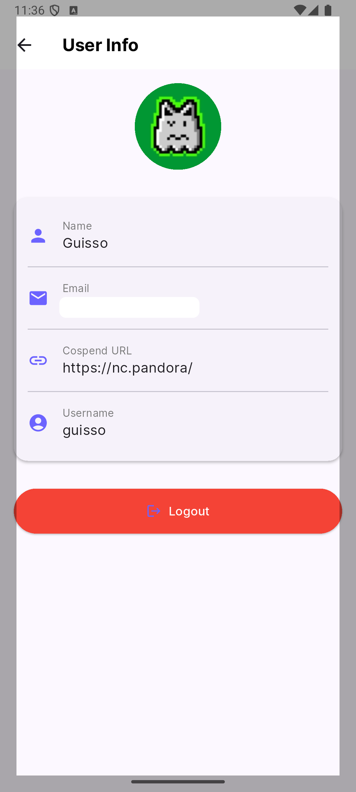

# 💰 CospendWise App

A Flutter app to make your [Nextcloud Cospend](https://apps.nextcloud.com/apps/cospend) experience more beautiful! ✨

|             Home Screen              |                Login                 |               User Info             |
| :----------------------------------: | :----------------------------------: |:----------------------------------: |
|  |  |  |

## 🌟 About This Project

Hey there! 👋 This is a special project with a unique story. I'm a programmer who had zero knowledge about Android, [Flutter](https://flutter.dev), or [Dart](https://dart.dev) when starting this. I didn't even understand the [Cospend API](https://github.com/eneiluj/cospend-nc/wiki/API-documentation)! What I did know was that I wanted something as beautiful as Splitwise (where I came from) but integrated with [Nextcloud Cospend](https://apps.nextcloud.com/apps/cospend).

I'm now a heavy Cospend user, but I found the [MoneyBuster](https://gitlab.com/eneiluj/moneybuster) mobile app didn't quite match what I was looking for in terms of UI/UX. So, with the help of [Claude AI](https://anthropic.com/claude), I created this project to experiment with a more modern interface.

### 🤝 Looking for Contributors!

If you're experienced with Flutter/Dart and share the same interest in making Cospend more beautiful, I'd love to hand this project over to you or a community to lead! Thanks to [MoneyBuster](https://gitlab.com/eneiluj/moneybuster) and [Cospend](https://github.com/eneiluj/cospend-nc) for providing inspiration both in terms of usability and implementations.

## ✨ Current Features

- 🔗 Connect with your [Nextcloud](https://nextcloud.com) instance
- 👤 Display your Nextcloud avatar
- 📋 List all your Cospend projects
- 💸 View bills in selected projects
- 🧮 Calculate balances (it's a bit messy, but we're trying!)

## 🚀 Getting Started

### Prerequisites

Before you begin, make sure you have:
- 📱 [Flutter SDK](https://flutter.dev/docs/get-started/install) installed
- 🔧 [Dart SDK](https://dart.dev/get-dart) installed
- ☁️ A [Nextcloud](https://nextcloud.com) instance with [Cospend app](https://apps.nextcloud.com/apps/cospend)

### Installation Steps

1. Clone the repository:
```bash
git clone https://github.com/fguisso/cospendwise.git
cd cospendwise
```

2. Install dependencies:
```bash
flutter pub get
```

3. Run the app:
```bash
flutter run
```

### 🔐 First Time Setup

1. Launch the app
2. Enter your Nextcloud instance URL
3. Log in with your credentials
4. Start managing your shared expenses! 🎉

## 🎨 UI Features

- [Material Design 3](https://m3.material.io) modern look
- Beautiful animations
- Intuitive navigation
- Overlapping avatars in groups
- Clean balance display

## 🙏 Acknowledgments

- Thanks to [Nextcloud Cospend](https://github.com/eneiluj/cospend-nc) for the amazing expense management app
- Thanks to [MoneyBuster](https://gitlab.com/eneiluj/moneybuster) for mobile app inspiration
- Thanks to [Claude AI](https://anthropic.com/claude) that helped create this project

---
Made with ❤️ and lots of [AI](https://anthropic.com/claude) help!